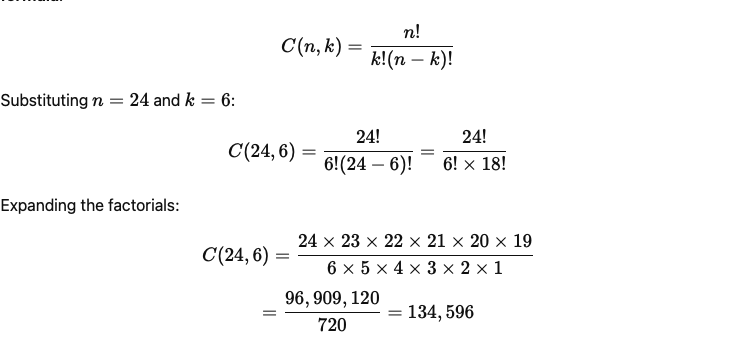

# 🃏 CSC213 Project 1 

## Part 1. The Card Class  

Issued: Wednesday, February 25

Due: Tuesday, March 25 at 11:59PM

You will have 3.5 weeks to complete this project.  This is due to the fact the third week falls during Spring break - it should only take 3 weeks at most!

This project is all about probability! You will implement a Java program that simulates drawing hands from a deck and tracks how long it takes to see every possible unique hand. You will write code to iterate through different deck sizes and hand sizes, running multiple trials to measure the number of attempts needed to achieve full coverage. Full coverage means observing every unique combination of hands for a given deck and hand size. For example, if you have a:  

- Deck size of 24 
- The 24 cards represent:

  - ♠ **Spades** A, K, Q, J, 10, 9

  - ♥ **Hearts** A, K, Q, J, 10, 9

  - ♦ **Diamonds** A, K, Q, J, 10, 9

  - ♣ **Clubs** A, K, Q, J, 10, 9

- For a hand size of 6, how long and how many attempts does it take you to see every combination of 6 cards?  The probability is expressed like this:



So, there are **134,596 unique ways** to select 6 cards from a deck of 24.  How many attempts do you need to get each and every one of those combinations!  

Throughout the process, your program will output real-time progress updates and save the final results for a trial to a CSV file for analysis. You will also set up a GitHub repository to manage your code and create a script to compile your project into a .jar file. This project will challenge your understanding of Java collections, probability, file handling, and real-world software development practices.

The skeleton code for this project is found here on GitHub: 

https://github.com/delveccj/CSC213.SP25.Project1.git

You will be responsible for cloning the project and completing the assignment tasks below.

---

## 🔧 **Step 1: Define the `Card` Class**  
In this step, you will implement a `Card` class that represents a standard playing card. Each card has:  

- A **suit** (♠ **Spades**, ♥ **Hearts**, ♦ **Diamonds**, ♣ **Clubs**)  
- A **rank** (**2–10, Jack, Queen, King, Ace**)  

Your task is to define the class, ensuring it passes the provided **JUnit test cases**.  This project follows a **Maven/Gradle-style structure**:  

```
src/
 ├── main/java/edu/canisius/csc213/project1/Card.java
 ├── test/java/edu/canisius/csc213/project1/CardTest.java
```

Your `Card.java` file should contain:  

- **Two enums**: `Suit` and `Rank` (already provided).  
- A **constructor** that initializes a card’s suit and rank.  
- **Getter methods** to access the suit and rank.  
- An **override of `toString()`** to display cards in `"RANK of SUIT"` format.  
- Proper **`equals()` and `hashCode()` methods** for object comparison.  

👉 **Here’s the starting code** (your job is to fill in the missing parts!):  

```java
package edu.canisius.csc213.project1;

/**
 * Represents a playing card with a suit and rank.
 */
public class Card {

    public enum Suit { HEARTS, DIAMONDS, CLUBS, SPADES }
    public enum Rank { 
        TWO, THREE, FOUR, FIVE, SIX, SEVEN, EIGHT, NINE, TEN, 
        JACK, QUEEN, KING, ACE 
    }

    // TODO: Define private fields for suit and rank.

    // TODO: Implement the constructor.

    // TODO: Implement getters for suit and rank.

    // TODO: Override toString() to return a readable format.

    // TODO: Override equals() and hashCode() for comparisons.
}
```

---

## 🧪 **Step 2: Make Sure Your Class Passes These Tests**  
A **JUnit test file (`CardTest.java`)** is provided to verify your implementation. Here’s what it checks:  

### ✅ **1. testCardCreation()**  
*Ensures a `Card` object is correctly created with the specified suit and rank.*  

```java
Card card = new Card(Card.Suit.HEARTS, Card.Rank.ACE);
assertEquals(Card.Suit.HEARTS, card.getSuit());
assertEquals(Card.Rank.ACE, card.getRank());
```

### ✅ **2. testToString()**  
*Checks if `toString()` returns a properly formatted string (e.g., `"KING of SPADES"`).*  

```java
Card card = new Card(Card.Suit.SPADES, Card.Rank.KING);
assertEquals("KING of SPADES", card.toString());
```

### ✅ **3. testEquality()**  
*Verifies that two identical cards are considered equal, but different cards are not.*  

```java
Card card1 = new Card(Card.Suit.CLUBS, Card.Rank.TEN);
Card card2 = new Card(Card.Suit.CLUBS, Card.Rank.TEN);
Card card3 = new Card(Card.Suit.DIAMONDS, Card.Rank.TEN);

assertEquals(card1, card2);  // Same suit & rank → should be equal
assertNotEquals(card1, card3); // Different suits → should not be equal
```

### ✅ **4. testHashCode()**  
*Ensures `hashCode()` is correctly implemented for object comparisons.* 
 
```java
Card card1 = new Card(Card.Suit.HEARTS, Card.Rank.THREE);
Card card2 = new Card(Card.Suit.HEARTS, Card.Rank.THREE);
assertEquals(card1.hashCode(), card2.hashCode());
```

---

## 🔧 **Step 3: Implement the `Deck` Class**  
The `Deck` class represents a **custom-sized deck of playing cards**, supporting shuffling and drawing.  

### **Deck Rules:**  
1. The deck **size** must be a **multiple of 4**, up to a maximum of **52**.  
2. The deck is built in the following order:  
   - **4 cards → 4 Aces of each suit**  
   - **8 cards → 4 Aces + 4 Kings of each suit**  
   - **12 cards → 4 Aces + 4 Kings + 4 Queens of each suit**  
   - … continues until **52 cards (full deck)**  
3. If an invalid size is provided, the constructor **throws an `IllegalArgumentException`**.  
4. The deck must have:  
   - **A method to shuffle the cards**.  
   - **A method to draw a card (removing it from the deck)**.  
   - **A method to get the number of remaining cards**.  

👉 **Here’s the starting code (fill in the missing parts!):**  

```java
package edu.canisius.csc213.project1;

import java.util.List;

/**
 * Represents a deck of playing cards with a configurable size.
 */
public class Deck {
    private final List<Card> cards;

    /**
     * Creates a deck with a given size.
     * The size must be a multiple of 4 and at most 52.
     * 
     * @param size The number of cards in the deck.
     * @throws IllegalArgumentException if size is invalid.
     */
    public Deck(int size) {
        // TODO: Validate size (must be a multiple of 4 and at most 52).
        // TODO: Initialize the deck with the correct cards.
    }

    /**
     * Shuffles the deck.
     */
    public void shuffle() {
        // TODO: Implement shuffle logic.
    }

    /**
     * Draws the top card from the deck.
     * 
     * @return The drawn card.
     * @throws NoSuchElementException if the deck is empty.
     */
    public Card draw() {
        // TODO: Implement draw logic.
        return null;
    }

    /**
     * Gets the number of remaining cards in the deck.
     *
     * @return The number of cards left.
     */
    public int size() {
        // TODO: Implement size method.
        return 0;
    }
}
```

---

## 🧪 **Step 4: Make Sure Your Classes Pass These Tests**  
The following tests are already written for you:  

### ✅ `DeckTest.java`  
- **Tests valid deck sizes** (4, 8, 12, …, 52).  
- **Checks invalid deck sizes** (e.g., 3, 55, 0).  
- **Verifies shuffling** changes card order.  
- **Tests drawing cards** until the deck is empty.  

**Run the tests and make sure all pass!**  

---

## 🧪 **Step 5: Dealing some cards**  

You will next implement the `UniqueHands` class, which simulates drawing random hands from a deck and measures how long it takes to see every possible hand.  

You will write code that:  
- Runs multiple **trials** for different **deck sizes (24, 28) only.  We could do larger sizes but it takes longer to complete!**.  
- Uses a **nested loop**:  
  - **Outer loop**: Iterates through different **deck sizes** (24,28).  
  - **Inner loop**: Iterates through different **hand sizes** (6 and 7).  
  - **Run 5 trials for each combination.**  
4. **Measure the number of attempts and time taken.**  
5. **Compute and print the average results.**  

👉 **Here is your starting template for `UniqueHands.java` (fill in the missing parts!):**  

```java
package edu.canisius.csc213.project1;

/**
 * UniqueHands class to analyze how long it takes to see every possible hand 
 * for different deck sizes and hand sizes.
 */
public class UniqueHands {
    public static void main(String[] args) {
        int[] deckSizes = {24, 28}; // Deck sizes to test
        int[] handSizes = {6, 7}; // Hand sizes to test
        int trials = 5; // Number of trials per deck-hand combination

        System.out.println("🃏 Deck Simulation: How long to see every possible hand?");
        System.out.println("------------------------------------------------------");

        // TODO: Implement nested loops
        // Outer loop: Iterates through deck sizes (24, 28)
        // Inner loop: Iterates through hand sizes (6, 7)
        // Inside inner loop: Run 5 trials, track time and attempts, and compute averages.  Which is probably another loop!

    }

    // TODO: Implement countAttemptsToSeeAllHands()
    // TODO: Implement calculateTotalUniqueHands()
}
```

---

## 📌 **Step 6: Run the Unit Tests for `UniqueHands`**  
We have provided a **set of unit tests** in `UniqueHandsTest.java`.  

#### ✅ **Unit Tests (`UniqueHandsTest.java`)**
```java
package edu.canisius.csc213.project1;

import org.junit.jupiter.api.Test;
import static org.junit.jupiter.api.Assertions.*;

class UniqueHandsTest {

    @Test
    public void testCalculateTotalUniqueHands() {
        assertEquals(134596, UniqueHands.calculateTotalUniqueHands(24, 6)); // Expected C(24,6)
        assertEquals(376740, UniqueHands.calculateTotalUniqueHands(28, 6)); // C(28,6)
        assertEquals(906192, UniqueHands.calculateTotalUniqueHands(32, 6)); // C(32,6)
        assertEquals(346104, UniqueHands.calculateTotalUniqueHands(24, 7)); // C(24,7)
    }    

    @Test
    void testCountAttemptsToSeeAllHandsIncreasesWithDeckSize() {
        int attempts24 = UniqueHands.countAttemptsToSeeAllHands(24, 6);
        int attempts28 = UniqueHands.countAttemptsToSeeAllHands(28, 6);
        int attempts32 = UniqueHands.countAttemptsToSeeAllHands(32, 6);

        assertTrue(attempts28 > attempts24, "Increasing deck size should increase attempts.");
        assertTrue(attempts32 > attempts28, "Increasing deck size further should increase attempts more.");
    }

    @Test
    void testCountAttemptsToSeeAllHandsIncreasesWithHandSize() {
        int attempts6 = UniqueHands.countAttemptsToSeeAllHands(24, 6);
        int attempts7 = UniqueHands.countAttemptsToSeeAllHands(24, 7);

        assertTrue(attempts7 > attempts6, "Increasing hand size should increase attempts.");
    }

    @Test
    void testMainRunsWithoutExceptions() {
        assertDoesNotThrow(() -> UniqueHands.main(new String[]{}), "Main method should run without errors.");
    }
}
```
Once again, you need to implement the methods to make the tests pass!

---

## 🧪 **Step 7: Ouput Updates to the Console**  

Once you implement `UniqueHands.java`, your program should produce output **exactly like this** shown below. If there are extra whitespaces - that is fine but the content must look like the output below.  Here, it shows the output of the first two trials for the selecting 6 cards from a deck size of 24. The last line of each trial is a wrap up of how it performed.  This will be discussed further in Step 8.  

```
Deck Simulation: How long to see every possible hand?
------------------------------------------------------
Progress: 52.46% coverage after 100,000 attempts (Unique Hands: 70,609 / 134,596 | Needed: 63,987)
Progress: 77.40% coverage after 200,000 attempts (Unique Hands: 104,178 / 134,596 | Needed: 30,418)
Progress: 89.20% coverage after 300,000 attempts (Unique Hands: 120,056 / 134,596 | Needed: 14,540)
Progress: 94.90% coverage after 400,000 attempts (Unique Hands: 127,736 / 134,596 | Needed: 6,860)
Progress: 97.56% coverage after 500,000 attempts (Unique Hands: 131,316 / 134,596 | Needed: 3,280)
Progress: 98.83% coverage after 600,000 attempts (Unique Hands: 133,020 / 134,596 | Needed: 1,576)
Progress: 99.46% coverage after 700,000 attempts (Unique Hands: 133,870 / 134,596 | Needed: 726)
Progress: 99.75% coverage after 800,000 attempts (Unique Hands: 134,255 / 134,596 | Needed: 341)
Progress: 99.89% coverage after 900,000 attempts (Unique Hands: 134,442 / 134,596 | Needed: 154)
Progress: 99.95% coverage after 1,000,000 attempts (Unique Hands: 134,522 / 134,596 | Needed: 74)
Progress: 99.98% coverage after 1,100,000 attempts (Unique Hands: 134,565 / 134,596 | Needed: 31)
Progress: 99.99% coverage after 1,200,000 attempts (Unique Hands: 134,576 / 134,596 | Needed: 20)
Progress: 99.99% coverage after 1,300,000 attempts (Unique Hands: 134,588 / 134,596 | Needed: 8)
Progress: 99.99% coverage after 1,400,000 attempts (Unique Hands: 134,592 / 134,596 | Needed: 4)
Progress: 99.99% coverage after 1,500,000 attempts (Unique Hands: 134,594 / 134,596 | Needed: 2)
Progress: 99.99% coverage after 1,600,000 attempts (Unique Hands: 134,594 / 134,596 | Needed: 2)
Progress: 99.99% coverage after 1,700,000 attempts (Unique Hands: 134,594 / 134,596 | Needed: 2)
Progress: 99.99% coverage after 1,800,000 attempts (Unique Hands: 134,595 / 134,596 | Needed: 1)
100.00% coverage reached after 1,803,213 attempts (Unique Hands: 134,596 / 134,596 | Needed: 0)
Deck Size: 24 | Hand Size: 6 | Trial 1 | Attempts: 1,803,213 | Time: 3.990 sec
Progress: 52.36% coverage after 100,000 attempts (Unique Hands: 70,477 / 134,596 | Needed: 64,119)
Progress: 77.28% coverage after 200,000 attempts (Unique Hands: 104,013 / 134,596 | Needed: 30,583)
Progress: 89.10% coverage after 300,000 attempts (Unique Hands: 119,919 / 134,596 | Needed: 14,677)
Progress: 94.85% coverage after 400,000 attempts (Unique Hands: 127,669 / 134,596 | Needed: 6,927)
Progress: 97.54% coverage after 500,000 attempts (Unique Hands: 131,280 / 134,596 | Needed: 3,316)
Progress: 98.82% coverage after 600,000 attempts (Unique Hands: 133,005 / 134,596 | Needed: 1,591)
Progress: 99.46% coverage after 700,000 attempts (Unique Hands: 133,868 / 134,596 | Needed: 728)
Progress: 99.74% coverage after 800,000 attempts (Unique Hands: 134,252 / 134,596 | Needed: 344)
Progress: 99.88% coverage after 900,000 attempts (Unique Hands: 134,430 / 134,596 | Needed: 166)
Progress: 99.94% coverage after 1,000,000 attempts (Unique Hands: 134,510 / 134,596 | Needed: 86)
Progress: 99.97% coverage after 1,100,000 attempts (Unique Hands: 134,550 / 134,596 | Needed: 46)
Progress: 99.98% coverage after 1,200,000 attempts (Unique Hands: 134,570 / 134,596 | Needed: 26)
Progress: 99.99% coverage after 1,300,000 attempts (Unique Hands: 134,586 / 134,596 | Needed: 10)
Progress: 99.99% coverage after 1,400,000 attempts (Unique Hands: 134,593 / 134,596 | Needed: 3)
100.00% coverage reached after 1,463,649 attempts (Unique Hands: 134,596 / 134,596 | Needed: 0)
Deck Size: 24 | Hand Size: 6 | Trial 2 | Attempts: 1,463,649 | Time: 2.936 sec
...
```

You will note that there are timing stats in the output above.  Use `System.nanoTime()` at **start** and **end** to calculate execution time.

## 🧪 **Step 8: Write reults of each trial to a CSV file**  
- Write a CSV file with **deck size, hand size, trial #, attempts, and time.**
- Name the file "unique_hands_results.csv" (an example is given in the GitHub repo you cloned)
- Here is the format your CSV file needs to adhere to:
  
  ```
  Deck Size,Hand Size,Trial,Attempts,Time (sec)
  24,6,1,1803213,3.990
  24,6,2,1463649,2.936
  ```

---
 
## 🧪 **Step 10: Compile Script and Jar File**  

You need to create a compile.sh script at the root level of your submission.  Here is a skeleton of what it should have in it.  The critical part is that it must allow me to run the MAIN_CLASS.  I actually want to run your code and make sure it works!!  This means you should test out the jar file you create to ensure it runs:

```
#!/bin/bash

# Define variables
SRC_DIR="src/main/java"
OUT_DIR="out"
JAR_FILE="uniquehands.jar"
MAIN_CLASS="edu.canisius.csc213.project1.UniqueHands"

# Clean previous build
echo "🧹 Cleaning previous build..."
# TODO You figure this out

# Compile Java files
echo "🚀 Compiling Java files..."
# TODO You figure this out

# Package into a JAR
echo "📦 Creating JAR file..."
# TODO You figure this out


# Done!
echo "✅ Build complete! Run it with: java -jar $JAR_FILE"
```

---

## 🧪 **Step 9: Submission**  
 
 You must create a public facing GitHub repo.  Your code should be accesible there for the instructor to download.  
 
 Note, try to keep this directory clean and do not include anything but the src directory with the live code in the `main` directory and the test code in the `test` directory.  A `.gitignore` has been included for you so that you may add files and directories you do not want to commit.  You should also include the compile.sh and the README.md.  If you want - you may include a CSV file populalted with your results as well.

 A DropBox on D2L has been created for the project.  You will need to add a text document that has the URL of your public facing GitHub project.

#Scoring Rubric
### **📌 Grading Rubric: CSC213 Project 1 (Unique Hands Simulation)**
**Total: 100 Points**  

| **Category**                | **Criteria** | **Points** |
|-----------------------------|-------------|------------|
| **GitHub Repository** (10 pts) | Repository is correctly set up, public, and contains only the necessary source and test files and compile script and README files. | **5** |
|  | Repository is properly structured with the correct package layout. | **5** |
| **Card Class Implementation** (15 pts) | `Card` class correctly defines `Suit` and `Rank` enums, and private fields for suit and rank. | **5** |
|  | Implements proper constructor, getters, `toString()`, `equals()`, and `hashCode()`. | **10** |
| **Deck Class Implementation** (15 pts) | Validates deck size (must be multiple of 4 and at most 52). | **5** |
|  | Implements shuffle, draw, and size methods correctly. | **10** |
| **Unique Hands Simulation** (30 pts) | Implements `UniqueHands.java` with correct looping structure (deck sizes, hand sizes, trials). | **10** |
|  | `countAttemptsToSeeAllHands()` correctly tracks unique hands, prints progress, and stops at 100% coverage. | **10** |
|  | Outputs correct format with `coverage%, unique hands seen, total unique hands, remaining hands needed`. | **10** |
| **Unit Testing & Code Reliability** (15 pts) | All provided JUnit tests pass (`CardTest.java`, `DeckTest.java`, `UniqueHandsTest.java`). | **10** |
| **Compile Script & JAR Packaging** (10 pts) | Correctly writes a `compile.sh` to compile and generate `.jar`. | **5** |
|  | `.jar` runs correctly with `java -jar uniquehands.jar`. | **5** |
| **CSV File Output** (10 pts) | Outputs correctly formatted CSV file with `Deck Size, Hand Size, Trial, Attempts, Time (sec)`. | **10** |

#Helpful Hints#
A Project 1 playground has been created for you on Zybooks.  You can try to do your development there.  However, it does not play nicely with GitHub - meaning you will need to download the project to one of the lab machines and then get it into GitHub.

Or, we can try and use these Ubuntu machines.  We will need to install Visual Studio Code.  Let's give it a try I guess!  This should work to install it:

```
sudo snap install --classic code
```
